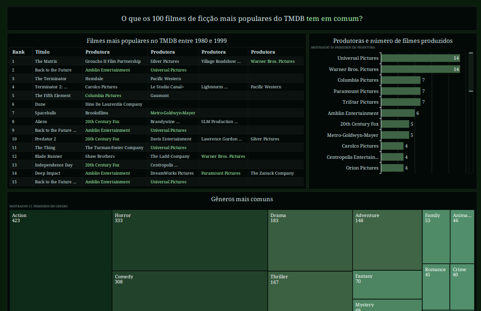

# Sprint 10 - Desafio Final AWS

O objetivo dessa sprint foi compilar todo o material criado e exibir os dados em um dashboard.

Esses dashboard foi feito no AWS Quicksight, permitindo uma análise rica e detalhada dos dados coletados para a visualização de insights relevantes.

## Certificados e Exercícios

Nessa sprint, não houveram exercícios ou certificados externos. O foco do estudo foi no desafio final.

## Desafio

[Clique Aqui 🔗](./desafio/README.md)

## Evidências

