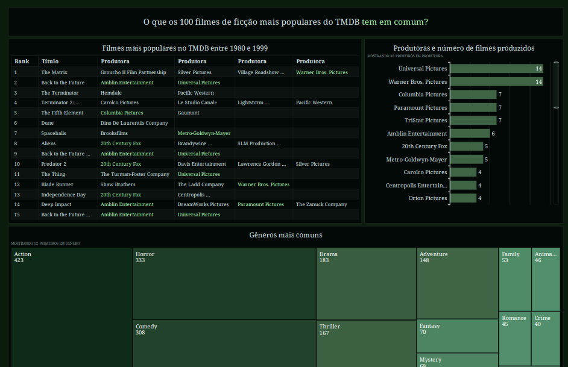

## Desafio Final, parte 5 (Gráficos)

Nessa etapa, todos os dados coletados e processados serão interligados ao recurso AWS Quicksight. Em seguida, houve a criação de um dashboard para exibir as informações mais relevantes.

### Perguntas que planejava responder (Desde a Sprint 6)

- Quais os filmes melhor avaliados, ordenados por popularidade?
- Quais outros gêneros mais aparecem junto com esse tipo de filme? E quais as palavras-chave mais comuns?

### Gráficos Usados

- Tabela exibindo os 100 melhores filmes e suas produtoras, ranqueados por popularidade no TMDB
- Gráfico de barras exibindo o número filmes feitos por produtora (limitado ao top 100)
- Mapa de árvore (Treemap) para exibir os gêneros mais comuns nos filmes de Sci-Fi (limitado ao top 100)
- Nuvem de palavras-chave mais comuns nos filmes (limitado ao top 100)

- Mapa com os países em que cada filme foi produzido ???

