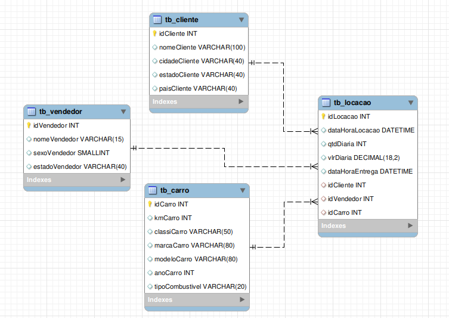

# Normalização do Banco de Dados Concessionária

## 1FN

A 1FN envolve a presença de chave primária, a garantia de que há um mesmo tipo de variável em cada coluna, e a atomicidade dos elementos, ou seja, cada célula da tabela armazena um valor.

Quanti a 1FN, pode-se considerar o banco como normalizado.

## 2FN

A 2FN exige que os atributos não chave devem depender inteiramente da chave primária da tabela em que estão inseridos.

Percebe-se no banco, que muitos atributos dependem de outros elementos que não são chave. Por isso, deve-se fazer a separação em tabelas em:

- Tabela de Locação
- Tabela de Cliente
- Tabela de Carro
- Tabela de Vendedor

Uma vez feito isso, adicionou-se as chaves estrangeiras para que haja relacionamento entre os valores, que foram separados em tabelas distintas.

## 3FN

Por fim, conforme a 3FN, é necessário evitar dependências transitivas dentro das tabelas.
Há uma dependência transitiva no id e no tipo de combustível o qual cada carro utiliza. Por isso, o id será removido, mantendo-se somente o id do carro e seu tipo de combustível.

Removeu-se também as redundâncias entre data de locação e de entrega: a data e a hora podiam ser armazenadas em uma só variável, já que as datas estavam no formato datetime. 

## Resultado Final

