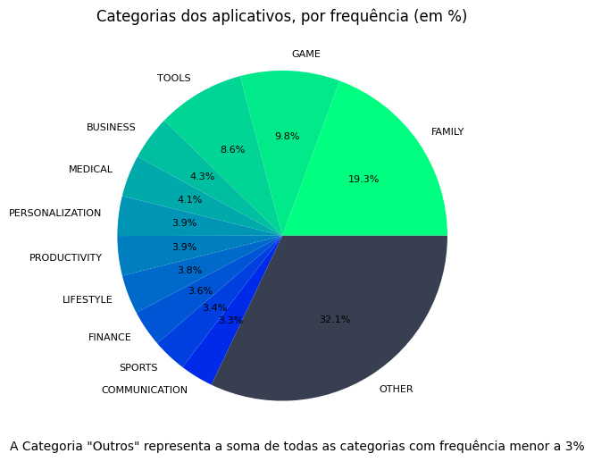
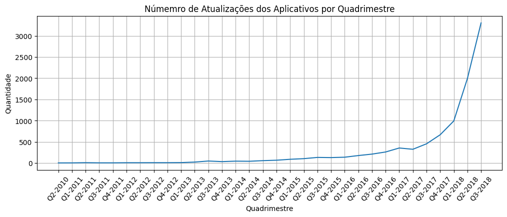

# Sprint 3 - Gráficos com Apps da Play Store

O objetivo da sprint era exercitar os comandos Python aprendidos, e utilizar as bibliotecas Matplotlib e Pandas para criar gráficos e extrair informações dos dados apresentados (planilha de dados da Google Play Store)

## Realização do Desafio

O diretório `./sprint3/desafio/` contêm todos os arquivos usados.

Para instalar as bibliotecas necessárias para os arquivos, pode-se usar o comando `pip install -r requirements.txt`.

O arquivo `desafio.ipynb` contém todas as informações pedidas no desafio.

A planilha utilizada foi a `googleplaystore.csv`, disponibilizada no próprio desafio.

## Certificados

Na pasta `./sprint3/certificados/` está o certificado referente ao curso da Sprint 3.

## Exercicios

Os exercicios da sprint estão no diretório `./sprint3/exrcicios/`. 

Pode usar os arquivos jupyter(.ipynb) ou os arquivos Python(.py)

## Evidências

Na pasta `./sprint3/evidencias/` estão alguns dos gráficos criados durante o desafio:

  

