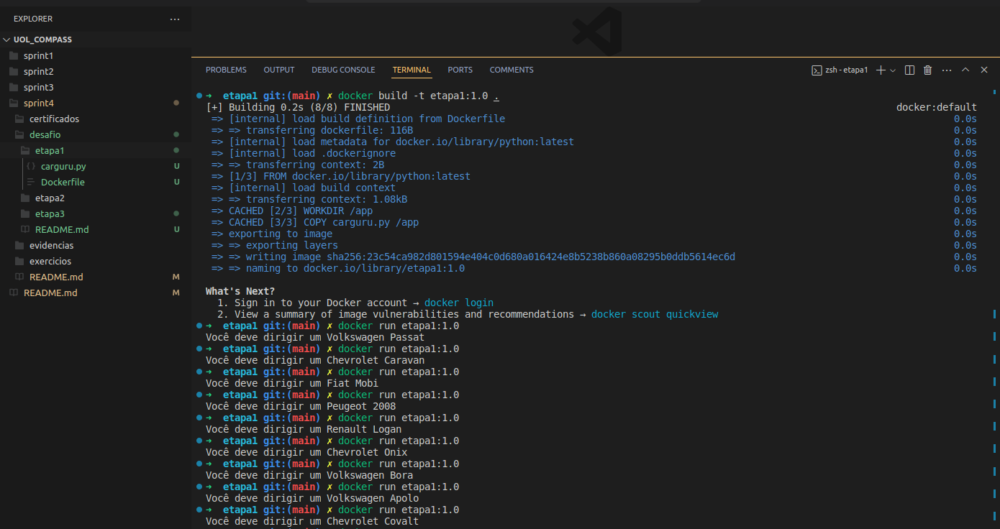
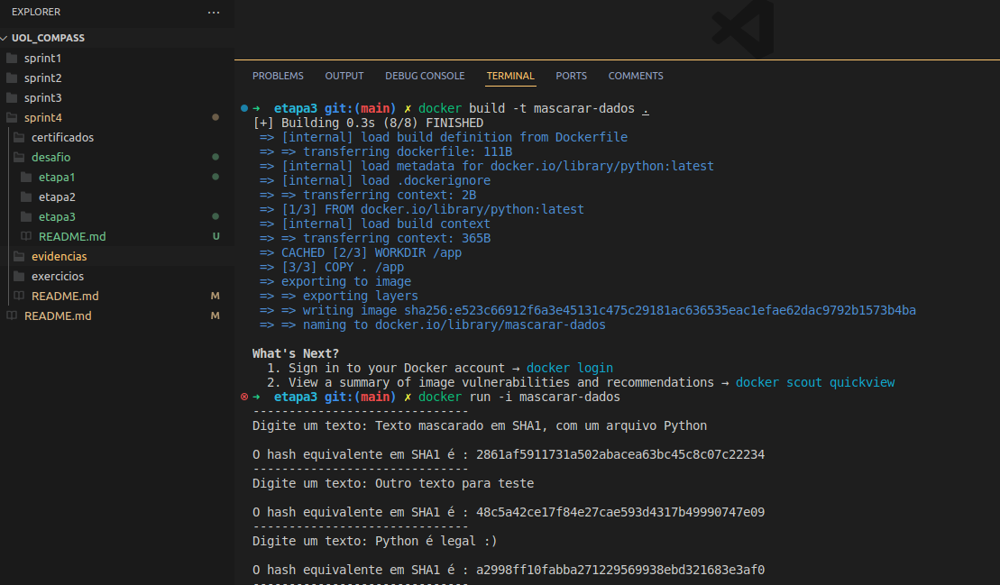

# Sprint 4 - Docker

O objetivo da Sprint era aplicar os conteúdos aprendidos, através da plataforma Docker e do uso da linguagem Python.

## Exercícios

Na pasta `./exercicios` estão as atividades da Sprint.

## Cerificados 

Na pasta `./certificados` está o certificado referente ao curso da Sprint 4.

No mesmo diretório, estão também os certificados dos cursos de Segurança e Metologias Ágeis, da Sprint 0.

## Realização do Desafio:

### Etapa 1

Criação de um container com o código de exemplo, que seleciona aleatoriamente uma modelo de automóvel.

O código está no arquivo `./desafio/etapa1/carguru.py`

#### Abrir o diretorio `./sprint4/desafio/etapa1` e executar os seguintes comandos:

Criar a imagem com `docker build -t etapa1:1.0 .`

Executar um container temporário com `docker run etapa1:1.0`

 

### Etapa 2

#### Pergunta: É possível reutilizar containers?

Sim, é possível reutilizar containers! Para isso, utilize o comando `docker ps -a` para ver todos os containers, incluindo os que não estão mais ativos.

Em seguida, use `docker commit {nome do container} {nome da nova imagem}` e utilize normalmente a nova imagem.

 

### Etapa 3

Criação de um container docker que recebe uma string, e mascara a string em um hash, usando o algoritmo SHA1.

O código está no arquivo `./desafio/etapa3/string_hash.py`

#### Abrir o diretorio `./sprint4/desafio/etapa3` e executar os seguintes comandos:

Criar a imagem com `docker build -t mascarar-dados .`

Executar um container interativo com `docker run -i mascarar-dados`

## Evidências:

Código da Etapa 1 sendo executado:

Código da Etapa 3 sendo executado:

