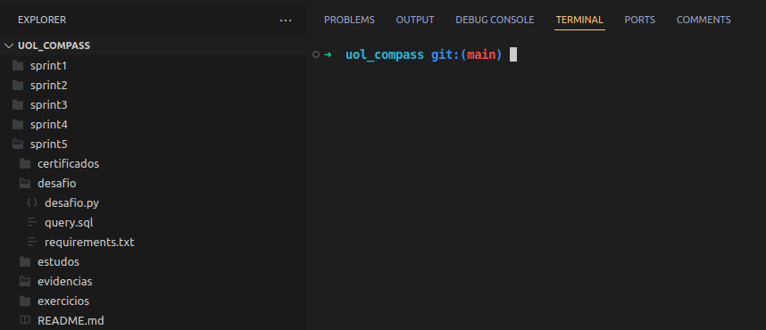
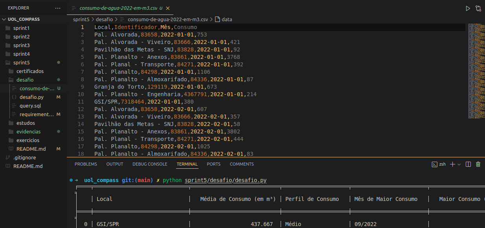
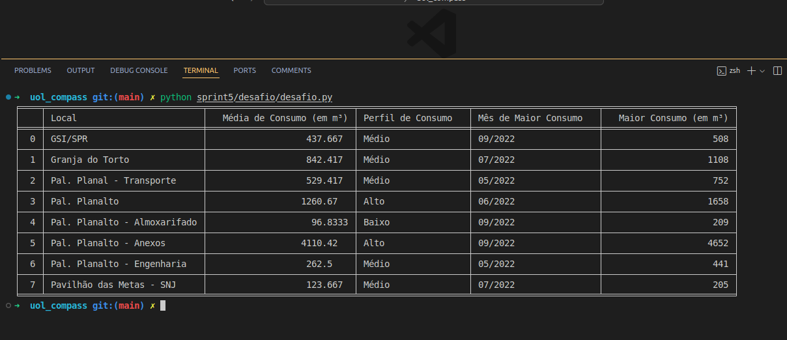

# Sprint 5 - AWS

O objetivo dessa sprint foi apresentar os diferentes recursos disponibilizados pela AWS, e exercitar os conteúdos aprendidos.

## Certificados

No diretório `sprint5/certificados` estão os certificados da AWS referentes a essa sprint.

## Desafio

Para o desafio desta sprint, devemos criar um Bucket no Amazon Simple Storage Service (S3) e realizar consultas em um arquivo dentro desse bucket.

### Conjunto de Dados

Meu arquivo contém dados de **Consumo de Água na Presidência da República em 2022, por m3**.

A planilha CSV inserida no bucket está disponível em `sprint5/desafio/consumo-de-agua-2022-em-m3.csv`.

A planilha possui como campos o **Local**, **número identificador**, **mês (representado por data)** e **consumo em m³**.

### Consulta SQL (com Python)

O desafio envolvia criar uma consulta que utilizasse:

- 2 operadores lógicos; (Utilizei NOT e AND)
- 2 funções de agregação; ( Utilizei AVG e MAX)
- 1 função condicional; (Utilizei CASE)
- 1 função de conversão; (Utilizei CAST para FLOAT)
- 1 função de data; (Utilizei STRFTIME)
- 1 função de string; (Utilizei LOWER)

A consulta que criei envolve exibir a **média de consumo, em 2022, de todas os locais que não estão relacionadas ao Palácio da Alvorada**.

Para isso, utilizei boto3, python e sqlite, através dos arquivos `sprint5/desafio/desafio.py` e `sprint5/desafio/query.sql`.

## Evidências

Diretório da Sprint 5 sem o arquivo CSV

Diretório da Sprint 5 com o arquivo CSV, baixado durante a execução do código

Resultado da query - Média de Consumo em 2022

