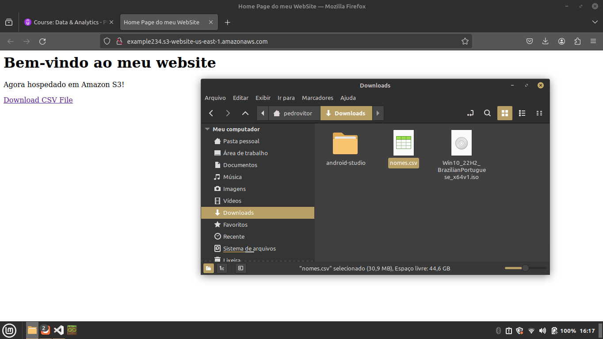
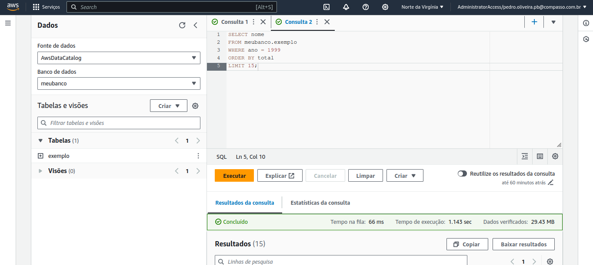
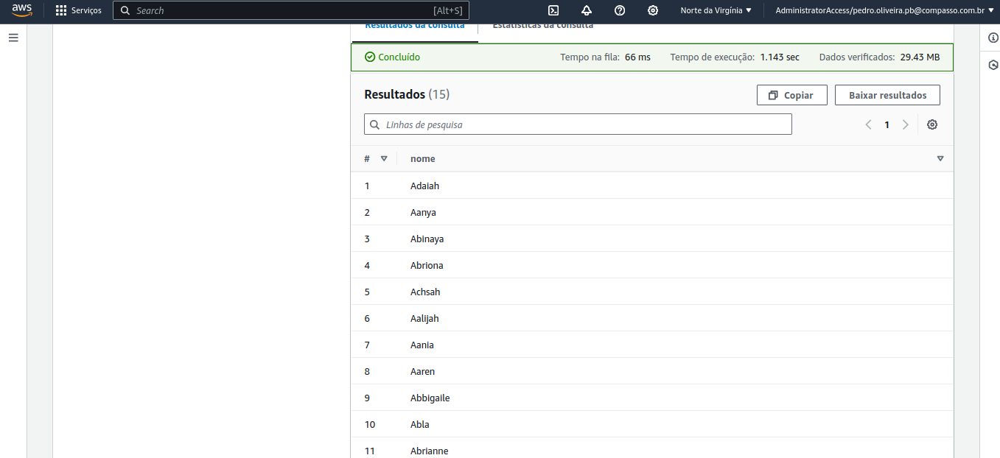
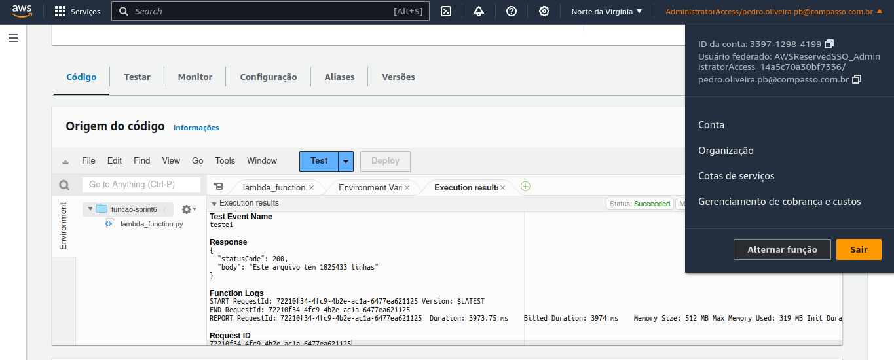
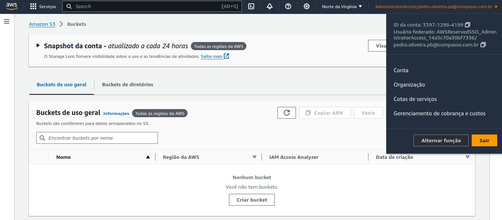
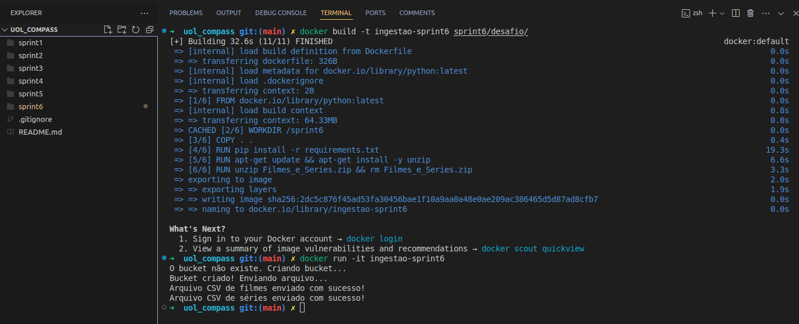
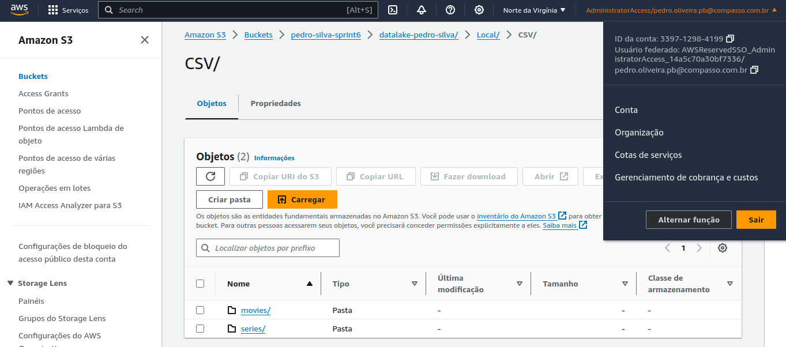

# Sprint 6 - AWS

O objetivo dessa sprint foi apresentar os diferentes recursos disponibilizados pela AWS, e exercitar os conteúdos aprendidos.

## Certificados

No diretório `sprint6/certificados` estão os certificados da AWS referentes a essa sprint.

## Exercícios

Clique Aqui 🔗

 

No diretório `sprint6/exercicios` estão os exercícios dessa sprint.

Trabalhamos com S3, Athena e Lambda, exercitando o conteúdo visto anteriormente.

### S3 - Envio de Arquivos e Hospedagem de Site Estático

| Site Hospedado e Arquivo Baixado com Sucesso |
| :------------------------------------------: |
|             |

### Athena - Criação de Banco de Dados com arquivo CSV

|                        Consulta                        |                       Resultado                        |
| :----------------------------------------------------: | :----------------------------------------------------: |
|  |  |

### Lambda - Consulta com bucket S3

|                        Consulta                        |                       Resultado                        |
| :----------------------------------------------------: | :----------------------------------------------------: |
|  |  |

## Desafio e Tema

O desafio desta sprint envolveu o início do desafio final do programa de bolsas da Uol Compass.

O tema que planejo abordar é de "**Filmes de Ficção Científica nas décadas de 80 e 90 (1980 - 1999)**".

Perguntas que planejo responder:

- Quais os filmes melhor avaliados?
- Quais outros gêneros mais aparecem junto com esse tipo de filme?

## Desafio Final, parte 1

Nesta etapa, começamos a ingestão dos dados. Os arquivos disponibililizados serão armazenados em um bucket S3, através da biblioteca Python 'Boto3', dentro de um container docker.

### Etapas

#### Abrir o diretorio `./sprint6/desafio/` e executar os seguintes comandos:

- Criar a imagem docker com o comando `docker build -t ingestao-sprint6 .`

- Executar o container de modo interativo com o comando `docker run -it ingestao-sprint6`

## Evidências

 Clique Aqui 🔗

 

|                   Bucket S3 Vazio                   |
| :-------------------------------------------------: |
|                  |
|                Execução do Container                |
|     |
|            Bucket S3, Agora com Conteúdo            |
|  |

