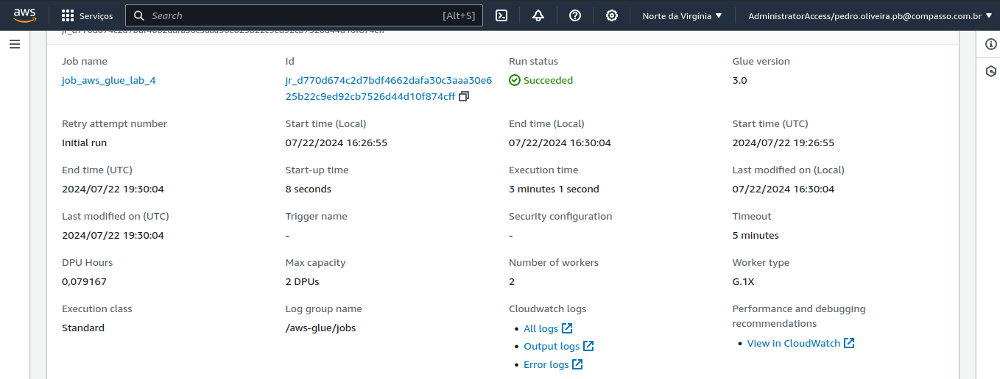
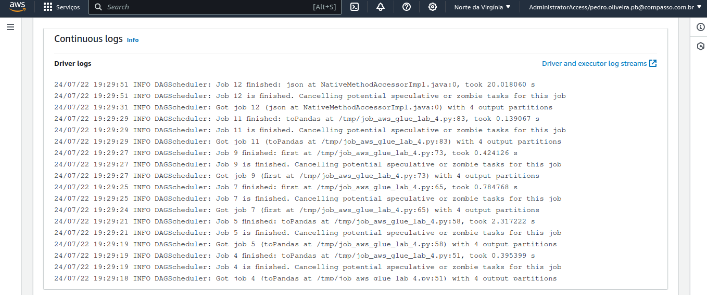
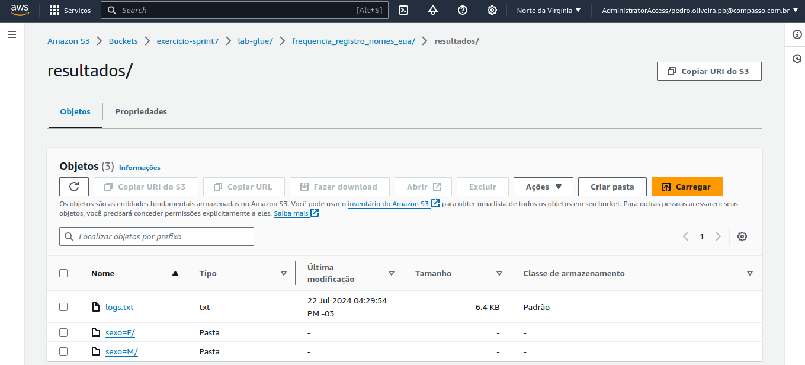
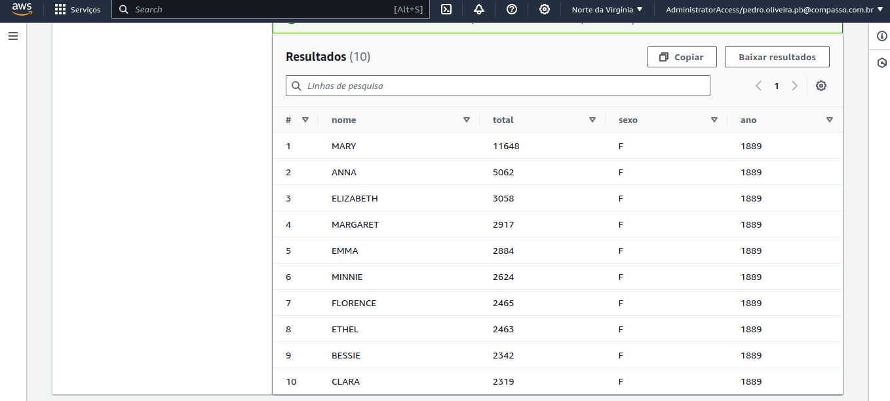
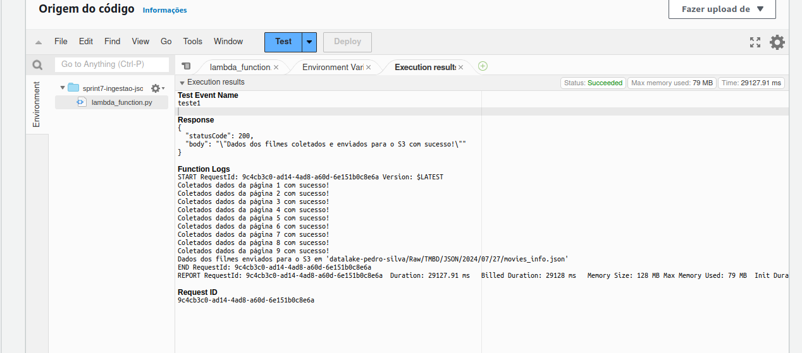
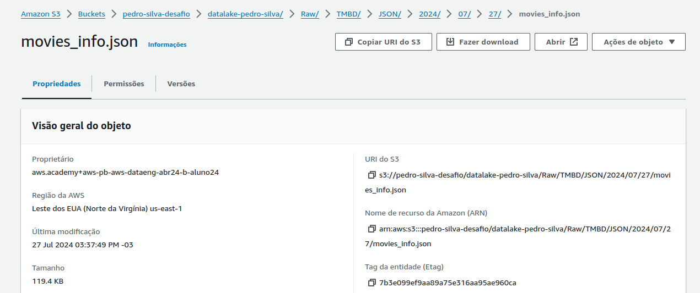
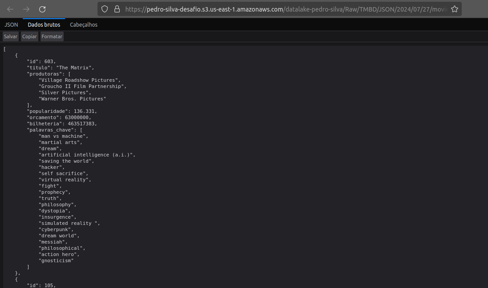

# Sprint 7 - AWS

O objetivo dessa sprint foi apresentar os diferentes recursos disponibilizados pela AWS, e exercitar os conteúdos aprendidos.

## Certificados

Não houveram certificados externos à Udemy nesta sprint.

## Exercícios

Clique Aqui 🔗

 

No diretório `sprint7/exercicios` estão os exercícios dessa sprint.

Trabalhamos com Spark e AWS Glue.

### Spark - Consulta com requisição web no Jupyter Notebook

[1]: exercicios/spark/exercicios_spark_notebook.png
[2]: exercicios/spark/exercicios_spark_resultado.png

| Consulta (clique para ver a imagem) | Resultado (clique para ver a imagem) |
| :---------------------------------: | :----------------------------------: |
|   [![Lab Spark - Imagem 1][1]][1]   |   [![Lab Spark - Imagem 2][2]][2]    |

### AWS Glue - Consulta com bucket S3

## Desafio

[Clique Aqui 🔗](./desafio/README.md)

## Evidências

 Clique Aqui 🔗

 

Logs do Código no Lambda

Arquivo recebido no S3

JSON visualizado com sucesso

