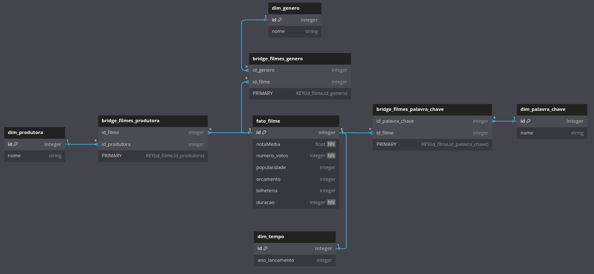

# Sprint 9 - AWS

O objetivo dessa sprint foi compilar todos os conteúdos vistos na AWS e no decorrer do programa de bolsas, e exercitar os conteúdos aprendidos.

## Certificados e Exercícios

Nessa sprint, não houveram exercícios ou certificados externos. O foco do estudo foi no desafio final.

## Desafio

[Clique Aqui 🔗](./desafio/README.md)

## Evidências

Clique Aqui 🔗

 

[1]: evidencias/evidencia1_job_glue.png
[2]: evidencias/evidencia2_crawler_glue.png
[3]: evidencias/evidencia3_dados_athena.png

|      Modelo Dimensional feito com o site DbDiagram.io       |
| :---------------------------------------------------------: |
|  |

| Jobs com CSV e JSON (clique para ver a imagem) | Execução do Crawler (clique para ver a imagem) |
| :--------------------------------------------: | :--------------------------------------------: |
|        [![Evidências- Imagem 1][1]][1]         |        [![Evidências- Imagem 2][2]][2]         |

| Consulta dos dados no AWS Atena (clique para ver a imagem) |
| :--------------------------------------------------------: |
|              [![Evidências- Imagem 3][3]][3]               |

