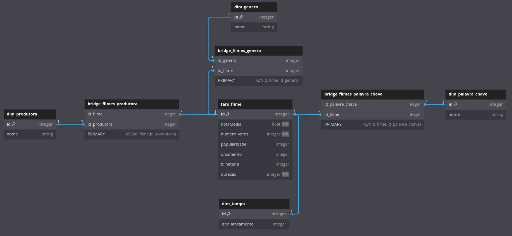

## Desafio Final, parte 4 (Processamento dos dados)

Nesta etapa, há a criação da camada Refined. Nela os dados são preparados os dados par uso. Tal preparo será feita com Spark, dentro de um ambiente AWS Glue, usando como base os arquivos da camada Trusted (criada na sprint anterior).

Nessa etapa serão criadas as Tabelas e as Views que serão usadas na próxima sprint.

### Passos necessários (os mesmos da sprint anterior)

- Criação de um usuário IAM

- Criação de uma função IAM (IAM Role) para acessar o Glue

- Liberar permissões e criar banco de dados no AWS Lake Formation

Essas etapas já foram feitas, então continuemos com os próximos passos.

### Banco de Dados Dimensional

Os dados foram estruturados, a partir dos arquivos Parquet, em um banco dimensional.

#### Estrutura:

- Fato: Filme
- Dimensões: Tempo(Ano), Gênero, Produtoras, Palavras-chave

|      Modelo Dimensional feito com o site DbDiagram.io       |
| :---------------------------------------------------------: |
|  |

### Criando Job no AWS Glue e Criando Crawler

O Job na AWS Glue realiza o processamento dos dados, une o CSV e o JSON em uma único arquivo, e cria as tabelas estruturadas, conforme o modelo acima.

O Crawler é um recurso para, a partir dos arquivos, criar tabelas acessiveis ao AWS Athena.

[1]: ../evidencias/evidencia1_job_glue.png
[2]: ../evidencias/evidencia2_crawler_glue.png
[3]: ../evidencias/evidencia3_dados_athena.png

| Jobs com CSV e JSON (clique para ver a imagem) |
| :--------------------------------------------: |
|        [![Evidências- Imagem 1][1]][1]         |

| Execução do Crawler (clique para ver a imagem) |
| :--------------------------------------------: |
|        [![Evidências- Imagem 2][2]][2]         |

| Consulta dos dados no AWS Atena (clique para ver a imagem) |
| :--------------------------------------------------------: |
|              [![Evidências- Imagem 3][3]][3]               |
